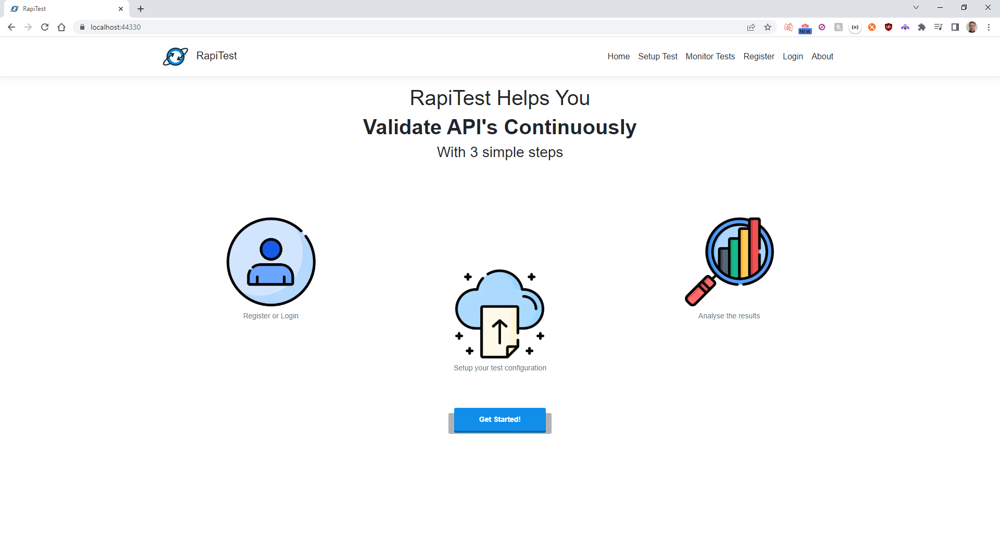

<div id="top"></div>
<!--
*** Thanks for checking out the Best-README-Template. If you have a suggestion
*** that would make this better, please fork the repo and create a pull request
*** or simply open an issue with the tag "enhancement".
*** Don't forget to give the project a star!
*** Thanks again! Now go create something AMAZING! :D
-->


<!-- PROJECT SHIELDS -->
<!--
*** I'm using markdown "reference style" links for readability.
*** Reference links are enclosed in brackets [ ] instead of parentheses ( ).
*** See the bottom of this document for the declaration of the reference variables
*** for contributors-url, forks-url, etc. This is an optional, concise syntax you may use.
*** https://www.markdownguide.org/basic-syntax/#reference-style-links
-->


<!-- PROJECT LOGO -->
<br />
<div align="center">
  <a href="https://github.com/DuarteFelicio/RAPITest">
    
  </a>

  <h3 align="center">RapiTest</h3>

  <p align="center">
    Validate API's Continuously with RapiTest!
  </p>
</div>


<!-- TABLE OF CONTENTS -->
<details>
  <summary>Table of Contents</summary>
  <ol>
    <li>
      <a href="#about-the-project">About The Project</a>
      <ul>
        <li><a href="#built-with">Built With</a></li>
      </ul>
    </li>
    <li>
      <a href="#getting-started">Getting Started</a>
      <ul>
        <li><a href="#docker">Docker</a></li>
        <li><a href="#locally">Locally</a></li>
        <li><a href="#installing-sql-server-on-macos">Installing SQL Server on macOS</a></li>
        <li><a href="#installing-entity-framework-on-macos">Installing Entity Framework on macOS</a></li>
        <li><a href="#additional-help-commands">Additional Help Commands</a></li>
      </ul>
    </li>
    <li><a href="#usage">Usage</a></li>
    <li>
      <a href="#test-specific-language-tsl">Test Specific Language, TSL</a>
      <ul>
        <li>
          <a href="#basic-structure">Basic Structure</a>
          <ul>
            <li><a href="#workflow">Workflow</a></li>
            <li><a href="#stress-test">Stress Test</a></li>
            <li><a href="#test">Test</a></li>
            <li><a href="#dictionary-file">Dictionary File</a></li>
            <li><a href="#verifications">Verifications</a></li>
            <li><a href="#retain">Retain</a></li>
          </ul>
        </li>
      </ul>
    </li>
    <li><a href="#contributing">Contributing</a></li>
    <li><a href="#contact">Contact</a></li>
  </ol>
</details>


<!-- ABOUT THE PROJECT -->
## About The Project



RapiTest is a web application for automated and semi-automated black-box testing of RESTful web APIs. It follows a model-based approach, where test cases are automatically derived from the OpenAPI Specification (OAS) of the API under test or manually derived from the Test Specification File (_TSL_). No access to the source code is required, which makes it possible to test APIs written in any programming language, running in local or remote servers.

The test cases derived from the TSL file allow for some greater customization compared to other tools that only use the OAS, such as:
* Custom HTTP query strings or headers for specific APIs that need an API key
* Native or Custom verifications to specific HTTP requests
* Workflow testing of certain endpoints
* Stress tests to specific workflows

<p align="right">(<a href="#top">back to top</a>)</p>


### Built With

This app was developed using these frameworks: 

* [ASP.NET Core](https://docs.microsoft.com/en-us/aspnet/core/?view=aspnetcore-6.0)
* [React.js](https://reactjs.org/)
* [Bootstrap](https://getbootstrap.com)
* [Microsoft SQL Server](https://www.microsoft.com/en-us/sql-server/sql-server-2019)
* [RabbitMQ](https://www.rabbitmq.com/)

<p align="right">(<a href="#top">back to top</a>)</p>


<!-- GETTING STARTED -->
## Getting Started

### Docker

The latest versions of the app are available as images in DockerHub, the docker-compose file is available under the folder _dockercompose_, simply copy it and run the command:

* docker-compose
  ```sh
  docker-compose up
  ```

After all images are up and running you can access the app at: https://localhost:8080

### Locally

If you want to run it directly without the use of docker here are the steps you need to make

#### Prerequisites

* Install Visual Studio 2019 (Compatibility with other versions is not guaranteed)
* Install Sql Server 2019 (Compatibility with other versions is not guaranteed). If you are using macOS (Intel or ARM CPUs), please refer to <a href="#installing-sql-server-on-macos">Installing SQL Server on macOS</a>.
* (Optional) Install Sql Server Management Studio (Windows) or Dbeaver (Multiplatform)
* Install RabbitMQ (Default Installation)
* Install Node.js and NPM
* Note: As this project was built using .Net Core 3.1, we might also need to install that .Net SDK version
* Note: If you don't have already a signed certificate (in PKCS#12 format), you might want to make sure you have OpenSSL installed

#### Installation

After having installed all the required software:

1. Clone the repo
  ```sh
  git clone https://github.com/DuarteFelicio/RAPITest.git
  ```
2. Create a Database
  ```sh
  Example name: RapiTestDB
  ```
3. Change Connection String Values<br/>
  Open the solution with Visual Studio and go to the _appsettings.json_ file of RAPITest, RunTestsWorkerService and SetupTestsWorkerService projects and change the line:
  ```sh
  //local
  "DefaultConnection": type your connection string here
  ```
4. Install NPM packages<br/>
  Open a command line in the folder `RAPITest/RAPITest/ClientApp` and run the command
  ```sh
  npm install
  ```
5. Configure the solution<br/>
  Make sure the solution is set to _run multiple projects_, _start_ RAPITest, RunTestsWorkerService and SetupTestsWorkerService and _none_ for ModelsLibrary
6. Create Database Tables<br/>
  - On Windows:<br/>
    Open the _package manager console_ (tools -> nuget manager -> package manager console).<br/>
    Please refer to <a href="#additional-help-commands">Additional Help Commands</a> to check .Net SDK version, that should be .Net Core 3.1.xxx.<br/>
    Make sure the default project is RAPITest.<br/>
    Run the command to perform Entity Framework database migration:
    ```sh
    EntityFrameWorkCore\Update-Database -Context ApplicationDbContext
    ```
  - On macOS:<br/>
    As macOS Visual Studio does not have a nuget package manager console, so we need to use `dotnet` commandline tools to install and execute the Entity Framework command. Please refer to <a href="#additional-help-commands">Additional Help Commands</a> to check .Net SDK version, that should be .Net Core 3.1.xxx and <a href="#installing-entity-framework-on-macos">Installing Entity Framework on macOS</a> for complete Entity Framework Core CLI installation.<br/>
    Make sure the default project is RAPITest.<br/>
    On RAPITest project folder open commandline and run the following command to perform Entity Framework database migration:
    ```sh
    dotnet ef database update -c ApplicationDbContext
    ```
7. Create a self-signed certificate to enable HTTPS<br/>
  If you have a certificate you want to use (in PKCS#12 format, PFX file extension) just place it in `RAPITest/RAPITest/certs` with name `certificate.pfx`, otherwise for local use follow the next commands.<br/>
  - Create a private key and Certificate Signing Request (CSR):
    ```sh
    openssl req -newkey rsa:2048 -keyout <key_name>.key -out <request_name>.csr
    ```
  - Create self-signed certificate
    ```sh
    openssl x509 -signkey <key_name>.key -in <request_name>.csr -req -days <number_of_days> -out <certificate_name>.crt
    ```
  - Convert PEM to PKCS12
    ```sh
    openssl pkcs12 -inkey <key_name>.key -in <certificate_name>.crt -export -out <certificate_name>.pfx
    ```
8. Run and enjoy!

<p align="right">(<a href="#top">back to top</a>)</p>

#### Installing SQL Server on macOS
  SQL Server is not supported directly over macOS. Instead we need to use a different approach to have SQL Server running on this systems. That alternative is to run SQL Server (or T-SQL compatible) as a container (like in Docker), so it is recommended you install `Docker`. The following steps detail the process for having SQL Server running on macOS systems for both existing CPU architectures (x64 and arm64).
  - x64 Architecture (Intel CPU):
    - Pull SQL Server docker container image (2019 version to comply with prerequisites):
      ```sh
      docker pull mcr.microsoft.com/mssql/server:2019-latest
      ```
    - Create and run SQL Server container:
      ```sh
      docker run --name SQLServer -e 'ACCEPT_EULA=Y' -e 'SA_PASSWORD=<strong_password>' -e 'MSSQL_PID=Express’ -p 1433:1433 -d mcr.microsoft.com/mssql/server:2019-latest
      ```
      where strong\_password should be at least 8 characters long and include uppercase and lowercase letters, numbers and symbols.
      <br/><br/>
    You can check the database by creating a new connection using Dbeaver with host as `localhost`, user as `sa` and password the one you specified.
    <br/><br/>
  - arm64 Architecture (Apple M1):
    Here the approach is a little different as the SQL Server docker image does not support `arm64` architecture. Instead we need to use a T-SQL compatible database like `Azure SQL Edge`.
    - Pull Azure SQL Edge docker container image:
      ```sh
      docker pull mcr.microsoft.com/azure-sql-edge
      ```
    - Create and run Azure SQL Edge container:
      ```sh
      docker run --cap-add SYS_PTRACE -e 'ACCEPT_EULA=1' -e 'MSSQL_SA_PASSWORD=<strong_password>' -p 1433:1433 --name AzureSQLEdge -d mcr.microsoft.com/azure-sql-edge
      ```
      where strong\_password should be at least 8 characters long and include uppercase and lowercase letters, numbers and symbols.
      <br/><br/>
    You can check the database by creating a new connection using Dbeaver with host as `localhost`, user as `sa` and password the one you specified.

<p align="right">(<a href="#top">back to top</a>)</p>

#### Installing Entity Framework on macOS
  To install the Entity Framework please run the following commands. We recommend to use version 5.0.17 to replicate the tested setup.
  - Install `dotnet-ef` package to enable support for Entity Framework in CLI:
    ```sh
    dotnet tool install --global dotnet-ef
    ```
    Alternatively if you want to install a particular Entity Framework version:
    ```sh
    dotnet tool install --global dotnet-ef --version <version_number>
    ```
  - Add Entity Framework tools to PATH:
    ```sh
    export PATH="$PATH:/Users/<your user folder>/.dotnet/tools"
    ```
  - Check if all projects inside solution are up-to-date:
    ```sh
    dotnet restore
    ```
  - Check if Entity Framework is working on CLI:
    ```sh
    dotnet ef
    ```
    You should see the Entity Framework informations.

<p align="right">(<a href="#top">back to top</a>)</p>

#### Additional Help Commands
- Check .Net SDK version
  ```sh
  dotnet --version
  ```
  ```sh
  dotnet --info
  ```
- Change the default .Net SDK to .Net Core 3.1
  If you installed the .Net Core 3.1 SDK in its default location you can use the following command direcly:
  ```sh
  sudo ln -s /usr/local/share/dotnet/x64/dotnet /usr/local/bin/
  ```
  In case you chose another location replace the complete path in the following command:
  ```sh
  sudo ln -s <complete_path_including_dotnet_executable> /usr/local/bin/
  ```

<p align="right">(<a href="#top">back to top</a>)</p>

<!-- USAGE EXAMPLES -->
## Usage

Demonstration on youtube coming soon. 

<p align="right">(<a href="#top">back to top</a>)</p>


<!-- ROADMAP -->
## Test Specific Language, _TSL_

<p>
As mentioned in the introduction, this app takes advantage of <i>TSL</i> files. 
</p>

<p>These are <i>YAML</i> files with the purpose of defining specific tests based on HTTP requests in order to specify tests that couldn't reliably be made automaticly with just the API's specification.</p> 

The app supports the creation of these files trough a simple UI, however not every functionality is supported trough this UI, leaving some functionalities to only a manual creation. 

### Basic Structure 

You can write _TSL_ files in _YAML_. A sample _TSL_ definition written in _YAML_ looks like:
```sh
  - WorkflowID: crud_pet

    Stress:
      Count: 40
      Threads: 5
      Delay: 0

    Tests:

    - TestID: createPet
      Server: "https://petstore3.swagger.io/api/v3"
      Path: "/pet"
      Method: Post
      Headers:
        - Content-Type:application/json
        - Accept:application/json
      Body: "$ref/dictionary/petExample"
      Retain:
        - petId#$.id
      Verifications:
        - Code: 200
          Schema: "$ref/definitions/Pet"

    - TestID: readPet
      Server: "https://petstore3.swagger.io/api/v3"
      Path: "/pet/{petId}"
      Method: Get
      Headers:
        - Accept:application/xml
      Verifications:
        - Code: 200
          Schema: "$ref/definitions/Pet"
          Custom: ["CustomVerification.dll"]

    - TestID: updatePet
      Server: "https://petstore3.swagger.io/api/v3"
      Path: "/pet/{petId}"
      Query:
        - name=doggie
        - status=sold
      Method: Post
      Headers:
        - Accept:application/xml
      Verifications:
        - Code: 200
          Schema: "$ref/dictionary/petSchemaXml"

    - TestID: deletePet
      Server: "https://petstore3.swagger.io/api/v3"
      Path: "/pet/{petId}"
      Method: Delete
      Headers:
        - Accept:application/json
      Verifications:
        - Code: 200     
```
#### Workflow

Every _TSL_ file must include atleast one workflow 
```sh
  - WorkflowID: crud_pet
```
The workflow needs an ID, which must be unique across all workflows. <br/>
One workflow must be comprised of one or more tests and optionally one stress test. All the tests inside the workflow are guaranteed to be executed sequentially which is usefull for situations where the output of one test influences the input of the other.

#### Stress Test

Optionally, one workflow can have one stress test 
```sh
  Stress:
      Count: 40
      Threads: 5
      Delay: 0
```
The stress test has 3 fields, Count, Threads and Delay.<br/>
* Count defines the number of times the complete workflow will be executed
* Threads defines the number of threads by which _Count_ will be divided (Count: 10 and Threads: 2 means each thread will execute the workflow 5 times)
* Delay defines the delay in milliseconds between every full execution, which can be usefull to prevent errors of too many executions 

#### Test

You can define one or more tests within each workflow
```sh
  Tests:

    - TestID: createPet
      Server: "https://petstore3.swagger.io/api/v3"
      Path: "/pet"
      Method: Post
      Headers:
        - Content-Type:application/json
        - Accept:application/json
      Body: "$ref/dictionary/petExample"
      Retain:
        - petId#$.id
      Verifications:
        - Code: 200
          Schema: "$ref/definitions/Pet"

    - TestID: readPet
      Server: "https://petstore3.swagger.io/api/v3"
      Path: "/pet/{petId}"
      Method: Get
      Headers:
        - Accept:application/xml
      Verifications:
        - Code: 200
          Contains: id
          Count: doggie#1
          Schema: "$ref/definitions/Pet"
          Match: /Pet/name#doggie
          Custom: ["CustomVerification.dll"]

    - TestID: updatePet
      Server: "https://petstore3.swagger.io/api/v3"
      Path: "/pet/{petId}"
      Query:
        - name=doggie
        - status=sold
      Method: Post
      Headers:
        - Accept:application/xml
      Verifications:
        - Code: 200
          Schema: "$ref/dictionary/petSchemaXml"

    - TestID: deletePet
      Server: "https://petstore3.swagger.io/api/v3"
      Path: "/pet/{petId}"
      Method: Delete
      Headers:
        - Accept:application/json
      Verifications:
        - Code: 200     
```

The test is identified with its id, which MUST be unique across all tests of every workflow
```sh
   - TestID: createPet
```

It is then followed by 3 mandatory fields for a successful HTTP request, the server, the path and the method
```sh
    Server: "https://petstore3.swagger.io/api/v3"
    Path: "/pet"
    Method: Post
```
(Currently the only supported methods are Get, Post, Put and Delete)

You can also define headers following a key/value structure
```sh
  Headers:
    - Content-Type:application/json
    - Accept:application/json
```

Which is similar for Query string parameters
```sh
  Query:
    - name=doggie
    - status=sold
```

The body data can be defined directly on the _TSL_ file, however they can sometimes be extremely large which would hurt the clarity and readability of the file. You can however create an auxiliary text file (dictionary file) which contains the actual body and a unique identifier within the dictionary, leaving only the reference to said identifier on the _TSL_ file
```sh
  Body: "$ref/dictionary/petExample"
```

#### Dictionary File

The dictionary file is a text file containing all the body data and schemas in order to improve clarity on the actual _TSL_ file
```sh
  dictionaryID:petExample
  {
    "id": 10,
    "name": "doggie",
    "status": "available"
  }

```
Every entry on the file requires the dictionaryID which must be unique across all entries, followed by the actual data, followed by an empty line to separate them

#### Verifications

Each test can have multiple verifications, only the Code verification is mandatory
```sh
  Verifications:
    - Code: 200
      Contains: id
      Count: doggie#1
      Schema: "$ref/definitions/Pet"
      Match: /Pet/name#doggie
      Custom: ["CustomVerification.dll"]
```
Currently 6 different verifications are supported:

| Requirement 	| Name     	| Input Type        	| Description                                                     	|
|-------------	|----------	|-------------------	|-----------------------------------------------------------------	|
| Mandatory   	| Code     	| Integer           	| Response code matches the given code                            	|
| Optional    	| Contains 	| String            	| Response body contains the given string                         	|
| Optional    	| Count    	| String#Integer    	| Response body contains given string # times                     	|
| Optional    	| Schema   	| String            	| Response body matches the given schema*                          	|
| Optional    	| Match    	| StringPath#String 	| Response body matches the given value present in the StringPath 	|
| Optional    	| Custom   	| [String]          	| Runs Custom verifications given by the user                     	|

\*The schema verification can be supplied directly, or through reference to the dictionary file or to any schema present in the supplied OAS  

#### Retain

In some requests, the input is based on the output of a previous request, usually in simple workflows, like create read<br/>
```sh
    Retain:
      - petId#$.id
```
The keyword Retain allows the user to retain some information from the response body of the request to then be used in other tests of the same workflow.<br/>
For instance the value present at the json path _$.id_ will be retained with the identifier _petId_ which can then be used in following tests
```sh
    Path: "/pet/{petId}"
```

<p align="right">(<a href="#top">back to top</a>)</p>


<!-- CONTRIBUTING -->
## Contributing

Contributions are what make the open source community such an amazing place to learn, inspire, and create. Any contributions you make are **greatly appreciated**.

If you have a suggestion that would make this better, please fork the repo and create a pull request. You can also simply open an issue with the tag "enhancement".
Don't forget to give the project a star! Thanks again!

1. Fork the Project
2. Create your Feature Branch (`git checkout -b feature/AmazingFeature`)
3. Commit your Changes (`git commit -m 'Add some AmazingFeature'`)
4. Push to the Branch (`git push origin feature/AmazingFeature`)
5. Open a Pull Request

<p align="right">(<a href="#top">back to top</a>)</p>


<!-- CONTACT -->
## Contact and Acknowledgements

This project was developed as part of a partnership between the Lisbon City council (CML) and Lisbon School of Engineering (ISEL) 

Duarte Felício - A42197@alunos.isel.pt</br>
José Simão - jose.simao@isel.pt</br>
Nuno Datia - nuno.datia@isel.pt</br>

Project Link: [https://github.com/DuarteFelicio/RAPITest](https://github.com/DuarteFelicio/RAPITest)

</br>To cite the work, please use the following text:</br>
Felício, D.; Simão, J. & Datia, N.</br>
RapiTest: Continuous Black-Box Testing of RESTful Web APIs </br>
CENTERIS - International Conference on ENTERprise Information Systems, 2022

<p align="right">(<a href="#top">back to top</a>)</p>


<!-- MARKDOWN LINKS & IMAGES -->
<!-- https://www.markdownguide.org/basic-syntax/#reference-style-links -->
[contributors-shield]: https://img.shields.io/github/contributors/othneildrew/Best-README-Template.svg?style=for-the-badge
[contributors-url]: https://github.com/othneildrew/Best-README-Template/graphs/contributors
[forks-shield]: https://img.shields.io/github/forks/othneildrew/Best-README-Template.svg?style=for-the-badge
[forks-url]: https://github.com/othneildrew/Best-README-Template/network/members
[stars-shield]: https://img.shields.io/github/stars/othneildrew/Best-README-Template.svg?style=for-the-badge
[stars-url]: https://github.com/othneildrew/Best-README-Template/stargazers
[issues-shield]: https://img.shields.io/github/issues/othneildrew/Best-README-Template.svg?style=for-the-badge
[issues-url]: https://github.com/othneildrew/Best-README-Template/issues
[license-shield]: https://img.shields.io/github/license/othneildrew/Best-README-Template.svg?style=for-the-badge
[license-url]: https://github.com/othneildrew/Best-README-Template/blob/master/LICENSE.txt
[linkedin-shield]: https://img.shields.io/badge/-LinkedIn-black.svg?style=for-the-badge&logo=linkedin&colorB=555
[linkedin-url]: https://linkedin.com/in/othneildrew
[product-screenshot]: images/screenshot.png
